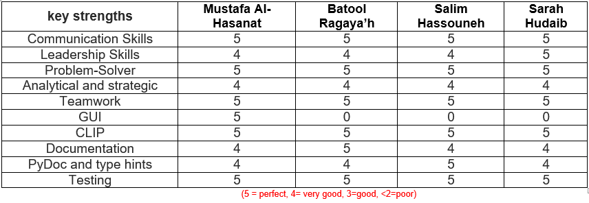
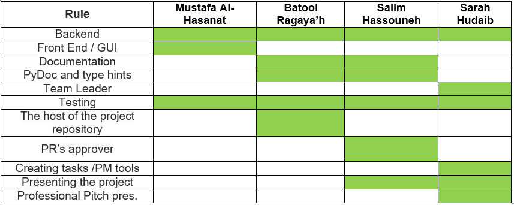
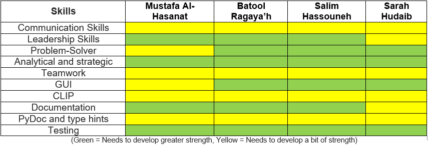
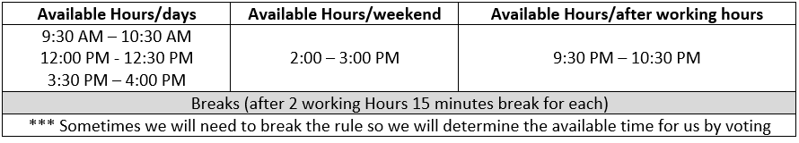

# Team Agreement

## Team Members:
-   Mustafa Alhasanat
-	Batool Ragaya’h
-	Salim Hassouneh
-	Sarah Hudaib

##	Project Background 
    An easy-to-use scientific calculator that supports many advanced features, including unit conversion, equation solving, and even complex-number math

    We will simulate different calculators for solving the different problems from mathematics, numerical methods, and number theory.

##	Project Description 
    Scientific calculators are used widely in situations that require quick access to certain mathematical functions, especially those that were once looked up in mathematical tables, such as trigonometric functions or logarithms. They are also used for calculations of very large or very small numbers, as in some aspects of astronomy, physics, and chemistry.

    Modern scientific calculators generally have many more features than a standard four or five-function calculator, and the feature set differs between manufacturers and models.

## Stretch Goals:
    -	Sudoku calculators: The input is a Sudoku puzzle, the operations support solving the puzzle, such as selecting a digit as the solution for a cell, and the result is a solution of the entire puzzle.
    -	Poker calculators: A common feature of these is to calculate the odds of winning with a given Poker hand.

----

##	Cooperation Plan 

- What are the key strengths of each person on the team?

-	How can you best utilize these strengths in the execution of your project?

-	In which professional competencies do you each want to develop greater strength?

-	Knowing that every person in your team needs to understand all aspects of the project, how do you plan to approach the day-to-day work?

        I’m planning to use GitHub repositories, issues, project boards, and other tools to plan and track our work, that’s will be specified in detail in the work plan section.

----
##	Conflict Plan

-	What will be your group’s process to resolve conflict, when it arises?

I believe that the best way to solve a conflict is by avoiding that in the first place but
If team conflict persists, i can address it by implementing these five steps:

    -	Speak to team members individually.
    -	Bring people together.
    -	Ask the wider team for ideas.
    -	Draw up a plan.
    -	Follow up.

-	What will your team do if one person is taking over the project and not letting the other members contribute?

        -	Communicate openly and honestly so team members understand just as much about the project as I do. 
        -	I will not hold back information about expected difficulties or any other aspect of the task. 
        -	When problems or roadblocks arise, I'll call on the whole team to help me solve the difficulty. 
        -	I'll give them the freedom to experiment with different solutions.  
        -	I'll give participants a chance to display their talents and ideas, and they'll be motivated to make the project a success.

-	How will you approach each other and the challenges of the project knowing that it is impossible for all members to be at the exact same place in understanding and skill level?

        -	Bring all the team and the TA conversations about a specific task on a single page 
        -	Every project includes a schedule and a team working for that project. 
        -	Stay on top of our schedule and know what’s coming up with calendar views. 
        -	Know who works on what part and get notified of tasks moving from one stage to another, keeping everyone together.

-	How will you raise concerns to members who are not adequately contributing?

        -	Try to resolve the problem at an early stage by talking to the team members. Most problems can be resolved with discussion and co-operation.
        -	If the cause of the not contributing is the kind of the tasks, I'll try to reformat the tasks.
        -	If the problem cannot be resolved informally, I'll ask for the instructional team to involve to solve it.

-	How and when will you escalate the conflict if your resolution attempts are unsuccessful?

        In certain situations, these disagreements spiral entirely out of control, especially if the causes of the conflict influence the entire team and the project's work process.

----
##	Communication Plan:

-	What hours will you be available to communicate?

-	What platforms will you use to communicate (i.e. slack, phone …)?

-	What is your plan if you start to fall behind?

        Prioritize each task:
        -	When we figure out which tasks need to be done first, we’ll know where to focus our energy. 

        -	In order to check the important tasks off our to-do list, we need to cut out the time-wasters. Meaningless things and other unnecessary tasks will pop up from time to time. 

        -	I'll write down a list of tasks. Then, decide where they lie on our list of priorities. Assign each task a number according to its priority.

        -	Next, I'll identify the requirements and time needed to complete each task. This will help us plan out a reasonable schedule for each day.

        -	Finally, I'll set a deadline for every task on our list. Some may already be on an external deadline.

-	What is your strategy for ensuring everyone’s voice is heard?
There are a few steps to do that as the following:

    -	Have fewer meetings or make them smaller
    -	Communicate ahead of time.
    -	Ask for feedback.
    -	Use the right tools.
    -	Assign roles.
    -	Ask for no interruptions.

----------------------------------------------------------------
##	Work Plan
-	How you will identify tasks, assign tasks, know when they are complete, and manage work in general?

        -	Project repositories: we can create a repository for a project we are collaborating on with others.
        -	Communicating repository information: by creating a CONTRIBUTING.md file specifically to contain guidelines on how users or contributors can contribute and interact with the team or project, such as how to open a bug fix issue or request an improvement.

-	Creating issue templates: 

>> we will use issues to track the different types of work our cross-functional team or project covers and gather information from outside of your project. The following are a few common use cases for issues may we use.

        1.	Release track: we can use an issue to track the progress for a release or the steps to complete the day of a launch.
        2.	Large initiatives: we can use an issue to track progress on a large initiative or project, which is then linked to the smaller issues.
        3.	Feature requests: our team can create issues to request an improvement to your product or project.
        4.	Bugs: our team or users can create issues to report a bug.

-	Making decisions as a team: 

        We can use issues and discussions to communicate and make decisions as a team on planned improvements or priorities for our project. Issues are useful when we create them for discussion of specific details, such as bug or performance reports, planning for the next quarter, or designing for a new initiative. Discussions are useful for open-ended brainstorming or feedback, outside the codebase and across repositories.

> As a team, we can also communicate updates on day-to-day tasks within issues so that everyone knows the status of work.

-	What project management tool will be used?

    -	Project management with GitHub using task lists, labels, and milestones.

----------------------------------------------------------------
##	Git Process
-	What components of your project will live on GitHub?

        	We want the code to be open source so that people can poke through and learn from it, but we want to keep any draft blog posts private until they are ready to go live.

-	How will you share the repository with your teammates?

    	 Everyone will be a contributor so that’s will allow us to be updated about the 
         workflow  

-	What is your Git flow?

        -	Creating a repository 
        -	Adding the team members
        -	Branching Code
        -	ACP 
        -	PR’s
        -	Merging 

-	How many people must review a PR? 

    	 2 people 

-	Who merges PRs?

    	 The TL

-	How often will you merge?

        -	We will commit our work until reaching or finishing a milestone then we will go to the next step.
        -	Then we will Test the output
        -	After finishing the previous 2 steps we will merge.
---

##	Schedule your practice session 
-	 First practice session will be held on April 26, 2022  
-	 The  second one will be held on April 27, 2022

---
## 	Submitting the Work
-	We will submit the project on April 27, 2022 